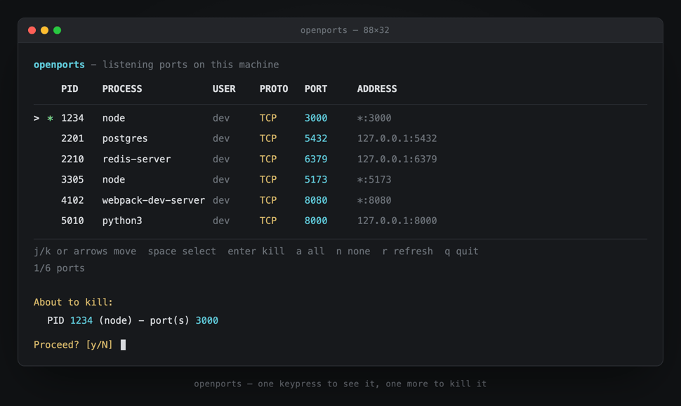
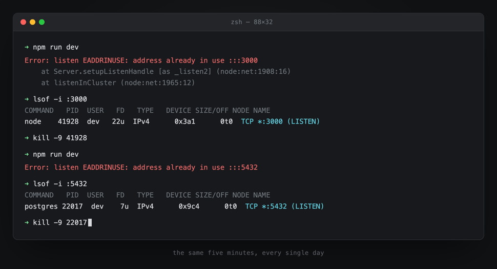

# openports

A tiny, interactive terminal tool that shows every port your machine is
listening on, and lets you close any of them in a couple of keystrokes.

No installer, no runtime, no dependencies to `npm install` — it's one bash
script that reads `lsof` output.



## Why

Every time you switch branches or spin up a new project, some old dev
server is still squatting on the port you need. The usual fix is:

```
lsof -i :3000
kill -9 <pid>
```

...repeated once per port, with no single view of everything your machine
currently has open, and one typo away from killing the wrong process.
`openports` turns that into: run it, arrow down to the row you want, hit
enter.



## Install

Requires macOS (or Linux) with `bash` and `lsof` — both are already on your
system.

```
git clone https://github.com/barath-dev/openports.git
cd openports
chmod +x bin/openports.sh
ln -s "$(pwd)/bin/openports.sh" /opt/homebrew/bin/openports   # Apple Silicon
# or:
ln -s "$(pwd)/bin/openports.sh" /usr/local/bin/openports      # Intel Mac / Linux
```

That symlink is what makes `openports` work as a plain command from any
directory afterwards. Pick whichever of the two target directories is
already on your `$PATH` (check with `echo $PATH`); `/usr/local/bin` may
need `sudo` since it's typically root-owned.

## Usage

Run `openports` with no arguments. Keys:

| Key                 | Action                                                      |
|---------------------|--------------------------------------------------------------|
| `↑`/`↓` or `j`/`k`   | move the cursor                                             |
| `space`              | select/deselect the current row                             |
| `a`                  | select every row                                             |
| `n`                  | clear the selection                                          |
| `enter`              | kill the selected row(s) (or just the current row if none are selected) |
| `r`                  | refresh the list                                             |
| `q` / `esc`          | quit                                                          |

Pressing enter always shows a confirmation first — exactly which PID,
process name, and port(s) are about to be killed — before anything happens.
Nothing is ever killed silently.

## How it works

It's genuinely just three ideas stacked on top of each other:

1. **Finding the ports.** `lsof -nP -iTCP -sTCP:LISTEN -F pcLPn` and
   `lsof -nP -iUDP -F pcLPn` list every socket a process is bound to, in a
   machine-parsable `-F` field format (`p` = pid, `c` = command, `L` =
   owner, `P` = protocol, `n` = address). An `awk` pass turns that into one
   row per unique `(pid, protocol, port)`, and drops any UDP entry that has
   a `->` in its address — those are outbound flows (e.g. QUIC on port 443),
   not ports your app is listening on for incoming connections.

2. **The interactive list.** Arrow-key navigation in plain bash, without
   any TUI library: `stty -echo -icanon` puts the terminal into raw mode so
   single keypresses are read immediately (no waiting for Enter), and the
   screen is redrawn with `tput cup`/`tput ed` each time you move. Because
   the target is the actual `/bin/bash` (3.2) macOS ships with, the script
   deliberately avoids anything that needs bash 4+ (like associative
   arrays) — everything is done with plain indexed arrays kept in sync by
   index.

3. **Killing, safely.** Confirming a kill sends `SIGTERM` and polls for up
   to ~1.5s; if the process is still alive (some processes ignore SIGTERM),
   it automatically escalates to `SIGKILL` — so you never have to notice a
   stubborn process and manually force-kill it yourself. Since killing a
   PID closes *every* port that process holds, the confirmation prompt
   always lists all of them up front, not just the one you had the cursor
   on.

## Permissions

Killing your own processes — which covers essentially every local dev
server, database, etc. — needs no special privileges. Killing a process
owned by another user or root requires `sudo openports`.

## Scope

Only *listening* sockets are shown (the "what's using port 3000" case).
Established/outbound connections are intentionally excluded to keep the
list focused on ports something is actually waiting for incoming
connections on.

## License

MIT — see [LICENSE](LICENSE).
